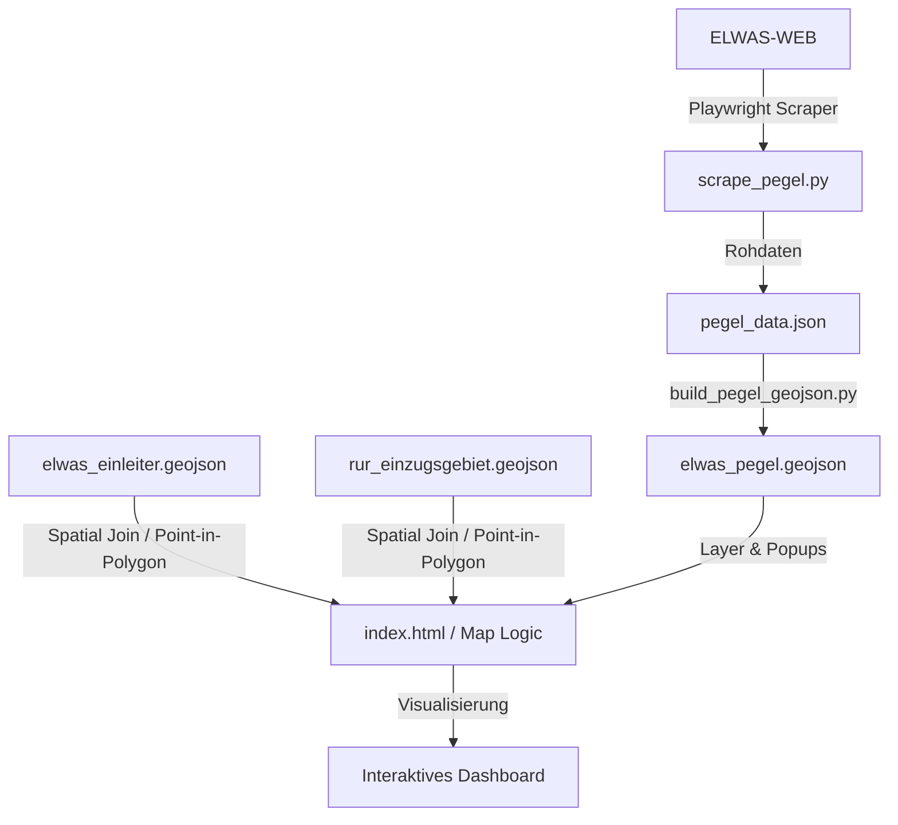

# 📋 Umsetzungplan: Einzugsgebiet-Statistiken & Pegeldaten-Integration

Dieses Dokument beschreibt die technische Umsetzung und Daten-Pipeline für die beiden neuen Anforderungen von Florian:
1. **Flusseinzugsgebiet-Statistiken:** Anzahl der Industriegebiete/Betriebe sowie summierte Abwassermenge ($m^3/a$) pro Flusseinzugsgebiet.
2. **Pegeldaten-Import:** Integration der ELWAS-Pegelmessstellen mit ihren Abfluss-Hauptwerten (MQ - Mittlerer Abfluss, NQ - Niedrigster Abfluss, HQ - Höchster Hochwasserabfluss).

---

## 📐 Architektur- und Datenflussplan



---

## 🛠️ Technische Umsetzungsschritte

### Teil 1: Pegeldaten-Scraping aus ELWAS-WEB
Wir erstellen ein neues Skript `elwas_raw_data/scrape_pegel.py`, das die Pegeldaten extrahiert.
* **Zielseite in ELWAS:** `Daten > Oberflächengewässer > Menge > Pegel`
  * Href: `/elwas-web/data/ow/menge/pegel/pegel.xhtml`
* **Dropdown-ID für Hauptwertauswahl:** 
  `cContainer:cCommonBodyContainer:j_idt463:searchOwdb2Pegel:searchPanel2Col:auswahlHWRow:auswahlHW`
* **Skript-Ablauf:**
  For each of the 7 districts (Düren, Heinsberg, Aachen, etc.):
  1. Open dataset.
  2. Select the main value (e.g. `MQ - Mittlerer Abfluss`, `NQ - Niedrigster Niedrigwasserabfluss`, `HQ - Höchster Hochwasserabfluss`).
  3. Enter district and click "Übernehmen".
  4. Click "Suchen".
  5. Scrape result table or click the detail buttons (using the new `input.buttonLink` selector) to extract:
     * `Ostwert in UTM (Zone 32N)` & `Nordwert in UTM (Zone 32N)`
     * Gauge Name (`Name des Pegels`) & Water Body (`Gewässer`)
     * Values for MQ, NQ, HQ.
  6. Transform UTM to WGS84 (Lat/Lng) via `pyproj`.
  7. Generate `elwas_pegel.geojson`.

---

### Teil 2: Einzugsgebiet-Statistiken (Spatial Join)
Um die Anzahl der Betriebe und die summierte Abwassermenge pro Flusseinzugsgebiet zu berechnen, nutzen wir die Leaflet-Kartenebene:
* **Datenquelle:** Bereits vorhandenes `rur_einzugsgebiet.geojson` (Polygone der Einzugsgebiete) und `elwas_einleiter.geojson` (Punkte der Industriebetriebe).
* **Algorithmus (Client-side via turf.js oder Leaflet-Geometrie):**
  * Für jedes Einzugsgebiet-Polygon wird gezählt, wie viele Punkte aus `elwas_einleiter.geojson` darin liegen (`booleanPointInPolygon`).
  * Die Werte für `gesamtabwasser_a` ($m^3/a$) aller darin liegenden Punkte werden summiert.
* **Visualisierung:**
  * **Choroplethenkarte:** Die Einzugsgebiet-Polygone werden farblich nach der summierten Abwassermenge abgestuft (z.B. dunkleres Rot für stärkere industrielle Belastung).
  * **Tooltip/Popup:** Beim Klick oder Hover auf ein Einzugsgebiet wird ein Popup mit den aggregierten Werten geöffnet:
    ```
    Einzugsgebiet: Rur (Mittellauf)
    Anzahl Industriebetriebe: 24
    Summierte Abwassermenge: 1.250.000 m³/a
    ```

---

### Teil 3: Pegel-Layer & Korrelation im Frontend
1. **Pegel-Marker:** Neue Pegelsymbole (z.B. ein blaues Wellen-Icon) werden auf der Karte platziert.
2. **Detail-Popup:** Zeigt die MQ-, NQ- und HQ-Werte der Messstelle.
3. **Korrelationsanalyse:**
   * Klickt der Nutzer auf ein Pegelsymbol, wird im Sidebar-Panel das Verhältnis zwischen der summierten Abwassermenge im *oberhalb liegenden* Einzugsgebiet und dem mittleren Abfluss (MQ) des Flusses berechnet und grafisch dargestellt (z.B. "Industrieabwasser macht ca. X% des mittleren Abflusses aus").
