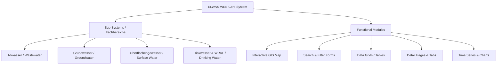

# ELWAS-WEB Modernization & Integration Plan

This document provides a deep functional analysis of the NRW State Water Database (ELWAS-WEB) and outlines a detailed technical strategy for implementing its core features in a modern, user-friendly, and high-performance web application (or integrating them directly into the existing [Akteurskarte](file:///C:/Users/user/.gemini/antigravity-ide/scratch/contact_map/index.html)).

---

## 🔍 Deep Functional Analysis of ELWAS-WEB

ELWAS-WEB is built on an older Enterprise Java framework (JavaServer Faces / PrimeFaces), which makes it slow, non-responsive on mobile devices, and complex to navigate. However, it contains rich datasets and powerful functional modules:



### 1. Core Modules and their Modern Counterparts
* **Interactive Map (GIS):** ELWAS uses a heavy server-side map renderer.
  * *Modern Alternative:* Client-side vector mapping using Leaflet.js or Maplibre GL JS, loaded with lightweight GeoJSON/Vector Tile layers.
* **Search & Filter Forms:** PrimeFaces forms with server-side state.
  * *Modern Alternative:* Reactive search forms (React/Vue or Vanilla JS with instant client-side filtering) with multi-select dropdowns and autocomplete.
* **Data Grids:** Paginated tables.
  * *Modern Alternative:* High-performance grids like Tabulator, AG-Grid, or simple custom HTML5 tables with client-side sorting/filtering.
* **Time Series (Zeitreihen):** Raw tables and slow static chart generation for water levels/quality.
  * *Modern Alternative:* Dynamic interactive charts using Chart.js, ApexCharts, or D3.js with zoom, pan, and date-range pickers.

---

## 🛠️ Implementation Plan: Building a "Modern ELWAS" Layer

We will integrate these features into your [Akteurskarte](file:///C:/Users/user/.gemini/antigravity-ide/scratch/contact_map/index.html) or build a standalone dashboard (e.g. `elwas_dashboard.html`).

### Step 1: Data Pipeline (Headless Scraper & Parser)
* **Goal:** Extract clean data from ELWAS-WEB without consuming user quota.
* **Approach:** Use the headless Playwright scraper we developed to fetch raw Excel files and compile them into structured GeoJSON files.
* **Target Files:**
  * `elwas_einleiter.geojson` (Discharging companies)
  * `elwas_klaeranlagen.geojson` (Municipal treatment plants)
  * `elwas_pegel.geojson` (River gauges & levels)

### Step 2: Interactive Mapping & Layer Controls
* Integrate the ELWAS data into your existing Leaflet map.
* Create a custom Sidebar/Panel containing Layer Controls:
  ```html
  <div class="layer-control-panel">
    <h3>Fachdaten (ELWAS)</h3>
    <label><input type="checkbox" id="layer-einleiter" checked> Direkt-/Indirekteinleiter (Industrie)</label>
    <label><input type="checkbox" id="layer-klaeranlagen"> Kommunale Kläranlagen</label>
    <label><input type="checkbox" id="layer-pegel"> Messstellen & Pegel</label>
  </div>
  ```

### Step 3: Advanced Filter Dashboard (Sidebar / Bottom Panel)
Instead of forcing the user to reload the page for every search, implement an instant search dashboard:
* **Search Input:** Fuzzy search matching company names, cities, or AbwV Annexes.
* **Annex Filter:** Dropdown list to filter by industrial sector (Chemie, Textil, Metall, etc.).
* **Quantity Range Slider:** Filter dischargers by wastewater volume ($m^3/d$ or $m^3/a$).

### Step 4: Premium Popups & Detail Cards
When a user clicks a point on the map, open a beautifully designed slide-out panel (Glassmorphism design) showing the details:
* **Header:** Company Name + Status (Active/Inactive)
* **Stammdaten:** District, municipality, UTM and WGS84 coordinates, and authority in charge.
* **Wastewater Quantity Card:**
  * Maximum Daily Discharge ($m^3/d$)
  * Maximum Hourly Discharge ($m^3/h$)
  * Total Annual Discharge ($m^3/a$)
* **Time Series Charting (for Gauges/Levels):**
  * Include a mini-chart (using Chart.js) showing historical water level trends directly in the details panel!

---

## 📐 Proposed Tech Stack for Integration
1. **Frontend:** Vanilla JS / HTML5 / CSS3 (matching existing `Akteurskarte` style) or a clean Vite-based setup if preferred.
2. **Mapping:** Leaflet.js with custom styled markers.
3. **Data Transformation:** Python (`pyproj` + `pandas`) to convert UTM to WGS84 coordinates and clean the data.
4. **Charting:** `Chart.js` (lightweight, responsive, and beautiful out of the box).

---

## 📋 Verification Plan

### Automated Tests
* Validate GeoJSON integrity: Check that all WGS84 coordinates fall inside the boundaries of NRW.
* Test responsiveness: Ensure Leaflet overlays load smoothly on mobile and desktop viewports.

### Manual Verification
* Compare the coordinate conversion results for a few sample companies (e.g. Düren 358458) against the official ELWAS-WEB map viewer to ensure perfect positioning.
